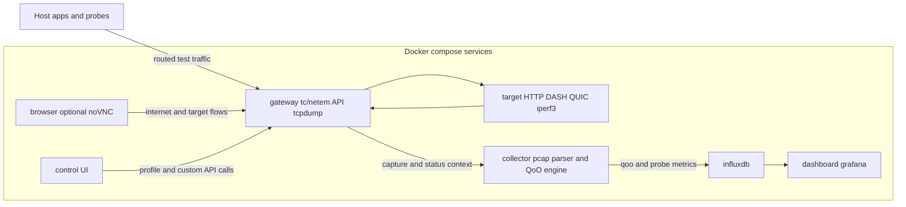

# QoO Hackathon Platform — Current Plan and State

This file documents the platform as it exists now and the intended near-term
maintenance direction.

## 1. Objective

Provide a reproducible demo platform for QoO evaluation where traffic is routed
through an emulated impairment gateway, measured continuously, and visualized
in near real time.

Core requirements kept:

- Routed impairment path through gateway
- Runtime profile switching
- Passive + active measurement collection
- QoO score computation and dashboarding
- Simple operator workflows for hackathon setup

## 2. Current architecture

Services in docker-compose:

- gateway
- target
- collector
- influxdb
- dashboard (Grafana)
- control (profile UI)
- browser (optional noVNC test browser)

Top-level flow:

1. Host test traffic enters gateway.
2. Gateway applies active tc/netem profile.
3. Traffic exits to target and returns through gateway.
4. Collector processes capture + profile state and writes metrics to InfluxDB.
5. Grafana dashboards render QoO and supporting telemetry.

### Main architecture diagram



## 3. Network model

- lan-net: 172.28.0.0/24
- wan-net: 172.29.0.0/24
- gateway LAN: 172.28.0.10
- target WAN: 172.29.0.20
- browser LAN: 172.28.0.30

Routing modes:

- Linux host: setup-routing/teardown-routing scripts (now default target is
  172.29.0.20 when omitted).
- macOS host: WireGuard fallback through gateway; preferred operator path is
  full-up/full-down scripts.

## 4. Measurement and scoring path

Passive collection:

- gateway writes pcap to data/pcap/capture.pcap
- collector parses packets, reconstructs flow metrics, computes RTT/loss/jitter/
  throughput, and derives qoo_score

Active collection:

- run-active-probes.sh writes probe metrics and logs
- run-godash.sh emits per-run exports and writes metrics via push helpers

Storage and visualization:

- InfluxDB is the single sink for qoo_* and related metrics
- Grafana dashboards read from InfluxDB

QoO scoring model in use:

- qoo_score uses min(latency, loss, throughput) semantics

## 4.1 Dashboard layout map

- `qoo-overview`: cross-source summary + threshold card
- `qoo-active-overview`: active metrics focus + threshold card
- `qoo-passive-overview`: passive metrics focus + threshold card
- `qoo-comparison`: repeated timeline rows for selected profiles

## 5. Profiles and control

Named profiles currently maintained:

- baseline
- latency-50ms
- latency-200ms
- jitter-20ms
- loss-1pct
- loss-5pct
- burst-loss
- combined-bad
- bandwidth-1mbit
- bandwidth-5mbit

Control surfaces:

- UI: http://localhost:8080
- API: /profiles, /status, /profile/<name>, /custom on gateway port 9000

QoO profile control (gateway API):

- GET /qoo-config
- POST /qoo-config
- GET /qoo-active-profile
- GET /qoo-profiles
- GET /qoo-profiles/<name>
- POST /qoo-profiles/<name>
- POST /qoo-profiles/load/<name>
- POST /qoo-profiles/reload
- POST /qoo-profiles/import
- GET /qoo-profiles/export/<name>

QoO profile persistence behavior:

- file set in `profiles/` is authoritative
- gateway reload mirrors current file set to Influx
- save/import returns 409 for existing name unless overwrite requested

## 6. Operator workflows

Preferred fast workflow (macOS hackathon machine):

1. ./scripts/full-up.sh
2. ./scripts/run-active-probes.sh 172.29.0.20 172.29.0.20 3 3
3. switch profile (UI/API), rerun probes
4. optional app-level runs via run-godash.sh
5. ./scripts/full-down.sh

Linux routed workflow:

1. docker compose up -d --build
2. ./scripts/setup-routing.sh
3. run probes/tests
4. ./scripts/teardown-routing.sh
5. docker compose down

## 7. Repository reality check

Current maintained docs:

- README.md: quickstart + architecture summary + concise troubleshooting
- CHEATSHEET.md: hackathon command card
- AGENTS.md: contributor/operator handoff and guardrails
- PLAN.md (this file): current state + maintenance plan

Current persisted data paths:

- data/pcap/
- data/influxdb/
- data/grafana/
- data/godash/
- data/active-probes/
- data/wg-keys/

QoO profile source directory:

- profiles/

### Repository structure (current)

```text
.
|-- docker-compose.yml
|-- README.md
|-- CHEATSHEET.md
|-- AGENTS.md
|-- PLAN.md
|-- gateway/
|-- target/
|-- collector/
|-- dashboard/
|-- control/
|-- browser/
|-- scripts/
|-- data/
`-- applications/
  `-- qoo-godash/
```

## 8. Explicitly dropped or not kept

The following are not part of the maintained architecture:

- Prometheus and Pushgateway-based metric pipeline
- optional client container fallback design
- spindump integration
- exploratory troubleshooting narrative tied to one-off dev incidents

## 9. Near-term maintenance plan

Keep focus on stability and demo reliability:

1. Preserve routed impairment behavior for both Linux and macOS paths.
2. Preserve browser split-path behavior:
   - local host access to :5800 should remain unaffected
   - internet-bound browser traffic should traverse gateway netem
3. Keep docs command-first and aligned with script defaults.
4. Prefer reproducible smoke checks after network/script changes:
   - run-active-probes baseline + one impaired profile
   - status/profile API checks
   - mac full-up/full-down cycle validation
5. Keep dashboard layout consistency across overview/active/passive/comparison.

## 10. Validation checklist after significant changes

- docker compose ps
- curl http://localhost:9000/status
- profile switch succeeds via UI or API
- ./scripts/run-active-probes.sh 172.29.0.20 172.29.0.20 3 3
- (macOS) full-up then routed ping/probe succeeds
- (optional) run-godash.sh tcp and browser :5800 smoke test

Dashboard-specific checks:

- no Grafana Flux compile warnings in `docker compose logs dashboard`
- profile selector and active profile display render in overview/active/passive
- comparison dashboard repeats one timeline block per selected profile
